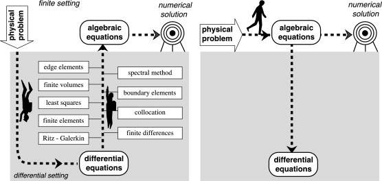

==================
Math & Physics Lab
==================

The professor Enzo Tonti's `Math & Physics Lab <https://github.com/decarlof/mathlab>`_ project aims to provide 
a series of small software programs implementing basic math and physics equations.

prof. Enzo Tonti :cite:`Tonti20141260c` at the University of Trieste, Italy, pioneered in 
the early '80s the use of personal computers for scientific computing inspiring generation 
of future computational scientists. 

We hope with this project to continue to inspire young student interests in math and physics
and to become the next generation of computational scientists.

Features
--------

* Collection of software programs implementing basic math and physics equations

Contribute
----------

* Documentation: https://github.com/decarlof/mathlab/tree/master/doc
* Issue Tracker: https://github.com/decarlof/mathlab/issues
* Source Code: https://github.com/decarlof/mathlab

Content
-------

.. toctree::
   :maxdepth: 1

   source/about
   source/install
   source/api
   source/demo
   source/credits

